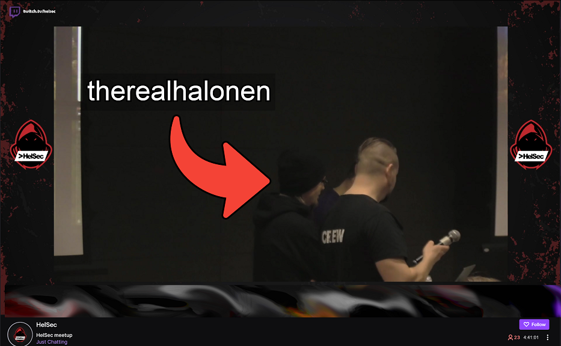
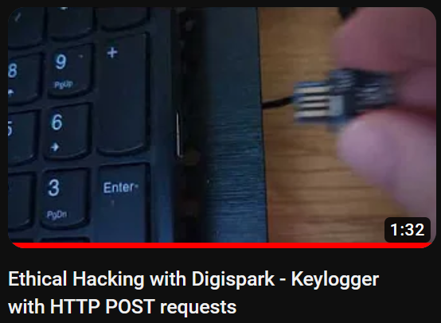
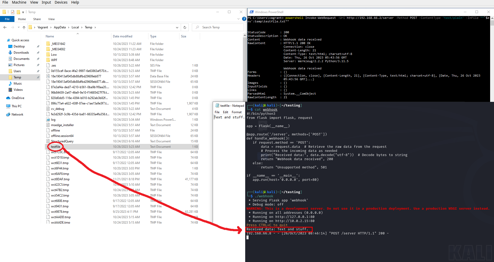

Always consider the local laws and ethical ramifications when doing pentesting

Simulated BadUSB dropper/sideloader, designed with three different payloads.   
Created and tested in safe computer lab environment by three future cyber security professionals.    

**YouTube:** [@phishsticks_pentest](https://www.youtube.com/@phishsticks_pentest/videos)   

---

## Table of Contents
- [About](## About)
- [Final Report](https://github.com/therealhalonen/PhishSticks/blob/master/documentation/Final_Report.md)
- [Mitigations](https://github.com/therealhalonen/PhishSticks/blob/master/documentation/Mitigations.md)
- [Work Blog](https://github.com/therealhalonen/PhishSticks/blob/master/documentation/MWork_Blog.md)
- Workflow notes:
  - [therealhalonen](https://github.com/therealhalonen/PhishSticks/blob/master/notes/halonen/notes.md)
  - [sawulohi](https://github.com/therealhalonen/PhishSticks/blob/master/notes/ollikainen/notes.md)
  - [miljonka](https://github.com/therealhalonen/PhishSticks/blob/master/notes/rajala/notes.md)

---

## About

Welcome to our project! We are a group of three students who share a passion for cyber security.   
This project is a part of the [Infrastructure Project 2023](https://terokarvinen.com/2023/infra-project-2023/) course led by our instructor, Tero Karvinen.    
In our journey to explore and enhance our skills, we have collaborated on a unique project – a Simulated BadUSB dropper/sideloader. This project is designed with three distinct payloads, showcasing the diverse ways in which BadUSB attacks can be employed.

### Project Highlights:

- **BadUSB Simulation:** Our project emulates the behavior of a BadUSB device, demonstrating potential security risks associated with USB attacks.

- **Diverse Payloads:** We have crafted [three different payloads](/payloads/), each highlighting the versatility and potential impact of BadUSB attacks. These payloads serve as educational tools, helping users understand the intricacies of such threats.

- **Working with [Digispark](http://digistump.com/products/1):** Digispark is a microcontroller development board that functions similiarly to Arduino, but is much smaller. Using this board gave us the capability to act as a HID keyboard, as well as provided some stealthiness due to its size. It can be hidden in a USB stick (or other devices)! Our documentation on Digispark can be found [HERE](/digispark/)!

### Our Process:

To see how we honed our project throughout weeks 37-48 of 2023, see our [Work Blog](https://github.com/therealhalonen/PhishSticks/blob/master/documentation/MWork_Blog.md)!

The entire development and testing process took place in a controlled and safe computer lab environment. As future cyber security professionals, we prioritize responsible and ethical exploration of security-related concepts. Our objective is to contribute to the cyber security community by providing insights into the risks associated with USB-based attacks.

Feel free to explore the various sections of this repository to learn more about our project, access the [final report](/documentation/final_report.md), explore [mitigations](/documentation/Mitigations.md), and get to know the [individuals behind this endeavor](#contact).

Thank you for your interest in our work!

    
---

## Contact

**Antti Halonen (therealhalonen):**    
- [LinkedIn](https://www.linkedin.com/in/antti-halonen-38662a231/)   
- [Github](https://github.com/therealhalonen)   

**Jari-Pekka Ollikainen (sawulohi):**   
- [LinkedIn](https://www.linkedin.com/in/jari-pekka-ollikainen-9ab62a224/)   
- [Github](https://github.com/sawulohi/)   

**Miika Rajala (miljonka):**   
- [LinkedIn](https://www.linkedin.com/in/miika-rajala-79866224b/)   
- [Github](https://github.com/miljonka/)   

**Youtube:**   
[PhishSticks Youtube](https://www.youtube.com/@phishsticks_pentest/videos)

Always consider the local laws and ethical ramifications when doing pentesting

Our YouTube channel: https://www.youtube.com/@phishsticks_pentest/videos

---

# Work Blog
### [Week 48](notes/week48.md)

# A new video dropped!

We made [an informative video](https://www.youtube.com/watch?v=bDzVevtZiWE) of a possible use case for PhishSticks. If you were unsure of how our project works, or if it works, this video should explain things quite clearly.

In other news, we were invited to present our project (in its current state) to our fellow students  in an actual lecture held by [Tero Karvinen on his Penetration Testing course](https://terokarvinen.com/2023/eettinen-hakkerointi-2023/#aikataulu)! (Fun fact: Juho "whois" Jauhiainen was the warm-up act for us. Yes, really.)

#### Quick update

# We presented our video at a [HelSec meetup](https://helsec.fi/)!

[therealhalonen](https://github.com/therealhalonen/) managed to score the last time slot in HelSec meetups Flashtalks!

You know what they say, only the first and last are remembered. Our video got a good response from the participating crowd!

---

### [Week 47](notes/week47.md)

#### Want to defend against our attacks?

It's now easy to block our attacks, just head to our [mitigations page](documentation/Mitigations.md)! We looked for a few ways of blocking our attack, and found a few nice ways to block wider attacks while doing so. For example you could [stop outgoing connections from powershell](documentation/Mitigations.md#block-powershell-from-windows-firewall) to stop the attack right on its tracks. Or if you know you're in danger of losing important files to a ransomware attack, Windows has [a built in setting](documentation/Mitigations.md#ransomware-protection---controlled-folder-access) that is not on by default!

#### Something BIG is coming....

Stay tuned and-

In other news, [therealhalonen](https://github.com/therealhalonen/) has made progress in improving the proof of concept keylogging into [a Flask web server via HTTP post](https://github.com/therealhalonen/PhishSticks/blob/master/notes/halonen/notes.md#16112023).

Also, our ransomware is starting to get noticed by ~~senpai~~ Windows Defender... It seems like you can run the Powershell script ONCE, and after the preliminary run, any further attempts get blocked. Some testing cases proved that the malware worked after a restart, but sometimes it didn't? We're working on finding out why.

---

### [Week 44](notes/week44.md)

#### A new [Youtube video](https://www.youtube.com/watch?v=XZkK8vzhyMw) just dropped!

In this video [therealhalonen](https://github.com/therealhalonen/) shows a brief physical demo of our latest version of the keylogger payload in action!

Go check it out now! [https://www.youtube.com/watch?v=XZkK8vzhyMw](https://www.youtube.com/watch?v=XZkK8vzhyMw)

---

### [Week 43](notes/week43.md)

#### End of the (working) week update

[therealhalonen](https://github.com/therealhalonen/) has honed his keylogger payload to log keypresses for a minute, send the log file to the attackers server via http POST and then delete the local log file, then rinse and repeat (you can manually set how many times the script is ran on [row 1 of the powershell script](https://github.com/therealhalonen/PhishSticks/blob/master/payloads/keylogger/keylog_ps/helper_post.ps1)).

We still need to work on making the payload(s) stickier (run at startup? other means?) and stealthier ([LOLBAS?](https://lolbas-project.github.io/#)). There is also a possibility of needing to further obfuscate the code in different places, and the needs should arise when further testing is done.

#### Living in the fast lane

The week has barely started and we have a working keylogger script. No. Scratch that. We have **two**. We worked around the issues [sawulohi](https://github.com/sawulohi/) faced last week by switching platforms from Windows to Linux, and made some changes to the source material. Namely, having comments or variables that contain something about keylogging is bad (or at least Windows Defender likes to think so). 

[miljonka](https://github.com/miljonka/) used [a python script that sends the logged data via email to the attacker](notes/rajala/notes.md#24102023)

[therealhalonen](https://github.com/therealhalonen/) chose to [obfuscate his powershell script with base64](notes/halonen/notes.md#24102023), and to send the data via [a HTTP POST](notes/halonen/notes.md#26102023).

**Both methods bypass Windows Defender**

#### Should you use a HTTP POST or email when sending your keylogger data?

Obviously we need to make a choice between the two methods. The team pondered between the pros and cons between the two. Here's a brief summary of our thoughts.

| email | HTTP POST |
| --- | --- |
| + easier to implement (using existing services) | - difficult to implement |
| - more difficult to implement encryption | + easier to implement encryption |
| - gives away more info about the attacker | + gives some info, but not as much |
| - trackable traffic | - trackable traffic |

We are moving on with using HTTP POST for now, but will consult [Tero](https://terokarvinen.com/) about the subject too.

---

### [Week 41](notes/week41.md)

#### Oneliners make you cooler (and you run faster too!)

The payloads written by [miljonka](https://github.com/miljonka/) and [therealhalonen](https://github.com/therealhalonen/) are now oneliners that execute from Windows Run. This results in the Digispark executing faster than previously, check out the notes from [therealhalonen](https://github.com/therealhalonen/PhishSticks/blob/master/notes/halonen/notes.md#12102023) and [miljonka](https://github.com/therealhalonen/PhishSticks/blob/master/notes/rajala/notes.md#11102023) for details!

[sawulohi](https://github.com/sawulohi/) ran into some [problems](https://github.com/therealhalonen/PhishSticks/blob/master/notes/ollikainen/notes.md#keylogging-with-digispark) with trying out demo code for the keylogger. Yikes!

There is also a new [Vagrant file](https://github.com/therealhalonen/PhishSticks/blob/master/notes/halonen/notes_res/Vagrantfile) for creating a virtual machine running Windows 10. This will expedite running tests in our lab environments on fresh systems. Testing should be ran on multiple instances in case you modify settings on older virtual machines and forget about it.

The payloads for reverse shell and ransomware are closing in on a demoable state, and it's quite likely that the team will focus on keylogging next...

Week 42 will be devoted to refreshing our minds (in other words, autumn holiday), so no work will be seen from that week. Rest is important for your brains!

---

### [Week 40](notes/week40.md)

#### Do you know what's in your phishsticks?

[therealhalonen](https://github.com/therealhalonen/) made a physical BadUSB-prototype! Fittingly scary, Halloween is just around the corner 😱👻

This week has sailed on the sidetracks, but it's all for the greater good & end results. And we firmly believe, that adapting workloads to fit weekly wants and motivations is good for the soul (a happy worker is a productive worker).

[therealhalonen](https://github.com/therealhalonen/) also made [a Finnish layout for Digisparks DigiKeyboard](https://github.com/therealhalonen/DigiKeyboardFi)(GitHub repository link)

[miljonka](https://github.com/miljonka/) made some progress on converting his [Python payload into an executeable file](https://github.com/therealhalonen/PhishSticks/blob/master/notes/rajala/notes.md#4102023):

[sawulohi](https://github.com/sawulohi/) worked on [changing the vendor & product id of the Digispark](notes/ollikainen/notes.md#changing-usb-vid--pid-on-digispark), ~~but to no avail~~ the changes were made, but they might be hard to find for the average user (which we - of course - are not). Testing on the subject will continue, as spoofing the ID of the device makes for good subterfuge.

We also produced a [python script](/notes/halonen/update_usbconfig.py) to automate the formatting of VID/PID into the usbconfig.h file. Databases containing VID/PID information often offer the bytes in a different format than what is used in the config files of the Digispark.

---

### Update on week 39

The Digisparks arrived! Hooray!

[miljonka](https://github.com/miljonka/) made [a preliminary GUI](notes/rajala/notes.md#**26.9.2023**) for his ransomware demo.

[therealhalonen](https://github.com/therealhalonen/) started testing [with Arduino IDE and the DigiSpark](https://github.com/therealhalonen/PhishSticks/blob/master/notes/halonen/notes.md#2992023).

[sawulohi](https://github.com/sawulohi/) waded through (boring) [management stuff](notes/ollikainen/notes.md#week-39), such as [creating a YouTube channel for the project](https://www.youtube.com/@phishsticks_pentest/videos) (please subscribe and like our videos!) We are proud to announce that our [Flipper Zero demo](https://www.youtube.com/watch?v=1kqqIdBoKr0) has already reached 23 views as of 2.10.2023! [sawulohi](https://github.com/sawulohi/) also wrote up instructions on how to start [uploading code to your own Digispark with the Arduino IDE](/notes/ollikainen/notes.md#digispark)

### [Week 39](notes/week39.md)

#### Good news everybody! Progress has been made!

[therealhalonen](https://github.com/therealhalonen/) wrote up some preliminary scripts for us to use and research in the project. There is a [demo for the reverse shell using Flipper Zero BadUSB.](notes/halonen/notes.md#2692023) See the video [here!](https://youtu.be/1kqqIdBoKr0)

[sawulohi](https://github.com/sawulohi/) will be looking up the example script [therealhalonen](https://github.com/therealhalonen/) provided that was written by [Mohamed Ezzat] (https://mohamedaezzat.github.io/posts/keylogger/)(licensed under CC BY 4.0 by the author.) to see if it's usable for the project. There is also research to be made about passthrough-capabilities for the keylogger, as well as actually sending the information.

[miljonka](https://github.com/miljonka/) wrote up a script based on [a video by NetworkChuck on creating ransomware with Python](https://www.youtube.com/watch?v=UtMMjXOlRQc). This week [miljonka](https://github.com/miljonka/) will be researching creating a GUI for the ransomware (possibly with [tkinter?](https://docs.python.org/3/library/tkinter.html)).

More testing & research is required, but everyone has a set direction and a goal to move towards.

#### Also. Bad news everybody! New risks on the horizon

The DigiSparks ordered through Amazon are still in transit. Hopefully someones dog hasn't eaten our homework \:\( . Tracking codes were provided, but they are not working. Will be looking to pick up DigiSparks from a physical vendor later this week.

---

### [Week 38](notes/week38.md)

Work has begun. We've made this GitHub page for following the progress on the project. See the [notes for this week](notes/week38.md).

---

# About

PhishSticks is a project made for [the Infra Project 2023 course](https://terokarvinen.com/2023/infra-project-2023/).

The goal of the project is to create a tool for ethical pentesting by making a simulated attack using a malicious USB device. The different types of malware include a keylogger, ransomware and reverse shell. [therealhalonen](https://github.com/therealhalonen/) [made a demo](https://github.com/therealhalonen/PhishSticks/tree/master/payloads/revshell_demo) that showcases a simple reverse shell that phones home (and bypasses Windows Defender with default settings!).

The target for the simulated attacks will always be a machine running Windows 10 on default settings.

The project will be finalized by 12.12.2023. All work noted here before the date is to be considered WIP.
