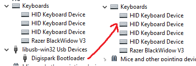
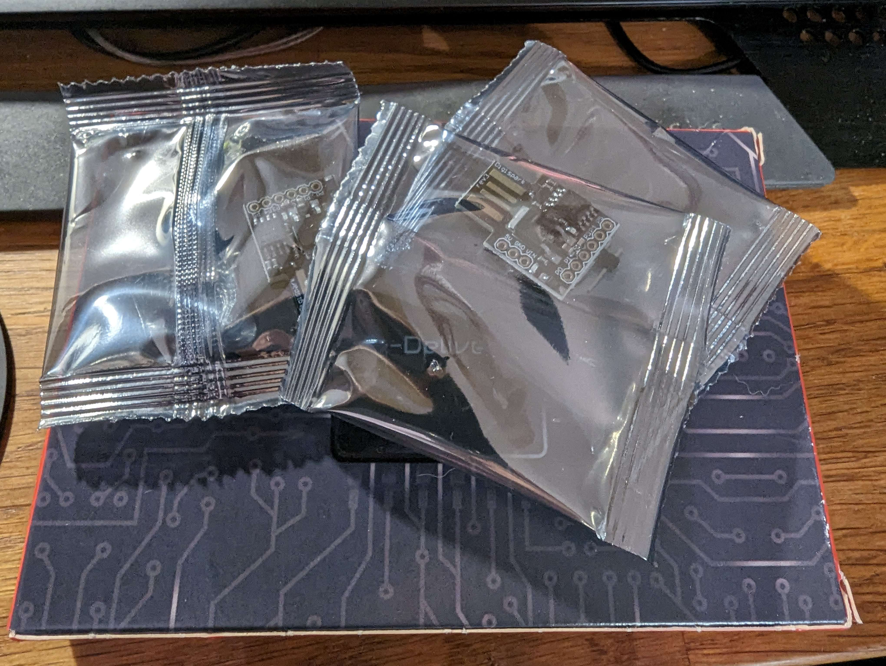
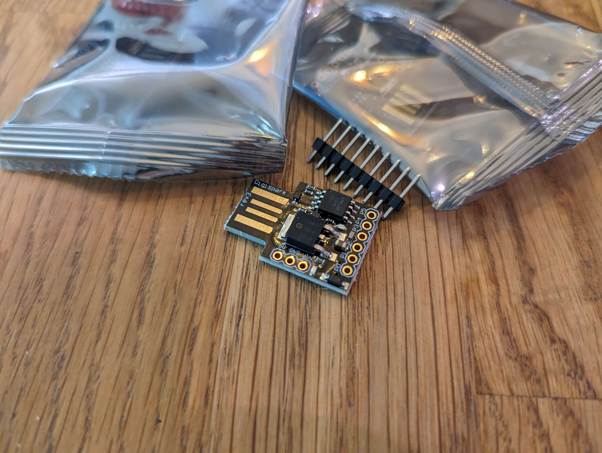

Always consider the local laws and ethical ramifications when doing pentesting

---

### [Week 40](notes/week40.md)

#### Do you know what's in your phishsticks?

[therealhalonen](https://github.com/therealhalonen/) made a physical BadUSB-prototype! Fittingly scary, Halloween is just around the corner 😱👻

This week has sailed on the sidetracks, but it's all for the greater good & end results. And we firmly believe, that adapting workloads to fit weekly wants and motivations is good for the soul (a happy worker is a productive worker).

[therealhalonen](https://github.com/therealhalonen/) also made [a Finnish layout for Digisparks DigiKeyboard](https://github.com/therealhalonen/DigiKeyboardFi)(GitHub repository link)

[miljonka](https://github.com/miljonka/) made some progress on converting his [Python payload into an executeable file](https://github.com/therealhalonen/PhishSticks/blob/master/notes/rajala/notes.md#4102023):

[sawulohi](https://github.com/sawulohi/) worked on [changing the vendor & product id of the Digispark](notes/ollikainen/notes.md#changing-usb-vid--pid-on-digispark), but to no avail. Testing on the subject will continue, as spoofing the ID of the device makes for good subterfuge.

---

### Update on week 39

The Digisparks arrived! Hooray!

[miljonka](https://github.com/miljonka/) made [a preliminary GUI](notes/rajala/notes.md#**26.9.2023**) for his ransomware demo.

[therealhalonen](https://github.com/therealhalonen/) started testing [with Arduino IDE and the DigiSpark](https://github.com/therealhalonen/PhishSticks/blob/master/notes/halonen/notes.md#2992023).

[sawulohi](https://github.com/sawulohi/) waded through (boring) [management stuff](notes/ollikainen/notes.md#week-39), such as [creating a YouTube channel for the project](https://www.youtube.com/@phishsticks_pentest/videos) (please subscribe and like our videos!) We are proud to announce that our [Flipper Zero demo](https://www.youtube.com/watch?v=1kqqIdBoKr0) has already reached 23 views as of 2.10.2023! [sawulohi](https://github.com/sawulohi/) also wrote up instructions on how to start [uploading code to your own Digispark with the Arduino IDE](/notes/ollikainen/notes.md#digispark)

### [Week 39](notes/week39.md)

#### Good news everybody! Progress has been made!

[therealhalonen](https://github.com/therealhalonen/) wrote up some preliminary scripts for us to use and research in the project. There is a [demo for the reverse shell using Flipper Zero BadUSB.](notes/halonen/notes.md#2692023) See the video [here!](https://youtu.be/1kqqIdBoKr0)

[sawulohi](https://github.com/sawulohi/) will be looking up the example script [therealhalonen](https://github.com/therealhalonen/) provided that was written by [Mohamed Ezzat] (https://mohamedaezzat.github.io/posts/keylogger/)(licensed under CC BY 4.0 by the author.) to see if it's usable for the project. There is also research to be made about passthrough-capabilities for the keylogger, as well as actually sending the information.

[miljonka](https://github.com/miljonka/) wrote up a script based on [a video by NetworkChuck on creating ransomware with Python](https://www.youtube.com/watch?v=UtMMjXOlRQc). This week [miljonka](https://github.com/miljonka/) will be researching creating a GUI for the ransomware (possibly with [tkinter?](https://docs.python.org/3/library/tkinter.html)).

More testing & research is required, but everyone has a set direction and a goal to move towards.

#### Also. Bad news everybody! New risks on the horizon

The DigiSparks ordered through Amazon are still in transit. Hopefully someones dog hasn't eaten our homework \:\( . Tracking codes were provided, but they are not working. Will be looking to pick up DigiSparks from a physical vendor later this week.

---

### [Week 38](notes/week38.md)

Work has begun. We've made this GitHub page for following the progress on the project. See the [notes for this week](notes/week38.md).

---

# About

PhishSticks is a project made for [the Infra Project 2023 course](https://terokarvinen.com/2023/infra-project-2023/).

The goal of the project is to create a tool for ethical pentesting by making a simulated attack using a malicious USB device. The different types of malware include a keylogger, ransomware and reverse shell. [therealhalonen](https://github.com/therealhalonen/) [made a demo](https://github.com/therealhalonen/PhishSticks/tree/master/payloads/revshell_demo) that showcases a simple reverse shell that phones home (and bypasses Windows Defender with default settings!).

The target for the simulated attacks will always be a machine running Windows 10 on default settings.

The project will be finalized by 12.12.2023. All work noted here before the date is to be considered WIP.