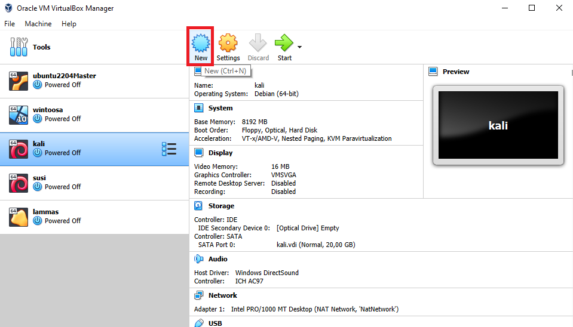
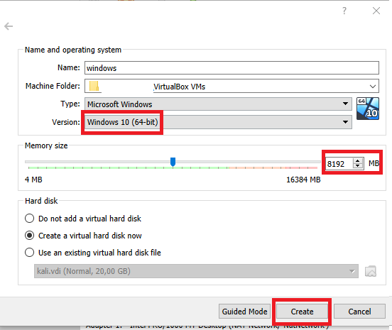
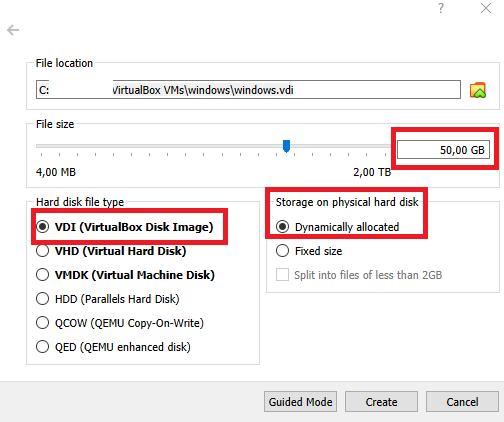

# Installing Windows 10 on a virtual machine

All testing is done (unless otherwise stated) on a computer with 
  * Processor	Intel(R) Core(TM) i7-8700K CPU @ 3.70GHz, 3696 Mhz
  * 16 GB RAM
  * GeForce GTX 1080 - series GPU
  * VirtualBox Version 6.1.26 r145957 (Qt5.6.2)

[https://www.microsoft.com/en-us/evalcenter/download-windows-10-enterprise](https://www.microsoft.com/en-us/evalcenter/download-windows-10-enterprise) can be used to obtain a .iso file. I used the English (Great Britain) 64-bit edition (not LTSC - Long-Term Servicing Channel - as I don't plan on using the virtual machines for extended periods of time).

Start up VirtualBox and select New

Name your virtual machine -> Set the operating system to Windows 10 -> Set the RAM to 8GB (or more if your host machine has the resources, Windows can be quite resource intensive) -> Press Create

Select your desired installation path and set the size of your virtual hard drive. I'm using 50GB just to ensure I won't run into disk space problems, but less would probably be alright too. For the Hard disk file type I chose VDI, and for the storage options I selected dynamically allocated. Dynamic allocation might be slower than fixed size disks, but allow for more flexibility for storage management. See [VirtualBox documentation](https://www.virtualbox.org/manual/ch05.html) on the subject for more information.

